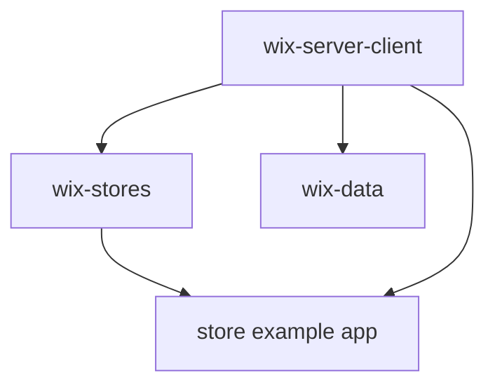
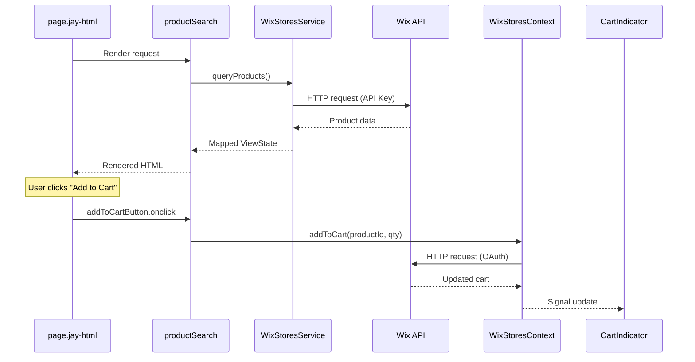

# Design Log 01: Wix Packages Structure

## Overview

The wix monorepo contains packages for integrating Jay Framework applications with Wix platform services. The architecture follows a layered pattern: base client → domain-specific services.

## Package Dependency Graph



## Package: `@jay-framework/wix-server-client`

**Purpose**: Base Wix SDK client configuration and authentication.

### Structure

```
wix-server-client/
├── lib/
│   ├── index.ts              # Server exports
│   ├── index.client.ts       # Client exports
│   ├── init.ts               # Plugin initialization (makeJayInit)
│   ├── config-loader.ts      # Load config from jay-config.yaml
│   ├── wix-client-service.ts # Server-side WixClient (API Key auth)
│   └── wix-client-context.ts # Client-side WixClient (OAuth)
└── plugin.yaml               # Jay plugin manifest
```

### Key Concepts

1. **Dual Authentication**:
   - **Server**: Uses API Key auth via `WIX_CLIENT_SERVICE` for SSR and server actions
   - **Client**: Uses OAuth auth via `WIX_CLIENT_CONTEXT` for browser API calls

2. **Init Pattern**:
   ```typescript
   export const init = makeJayInit()
     .withServer(async () => {
       const config = loadConfig();
       provideWixClientService(config);
       return { oauthClientId: config.oauth.clientId };
     })
     .withClient(async (data) => {
       await provideWixClientContext(data.oauthClientId);
     });
   ```

3. **Configuration** (in the project `config/.wix.yaml`):
   ```yaml
    apiKeyStrategy:
        apiKey: "..."
        siteId: "..."
    
    oauthStrategy:
        clientId: "..."
    ```

### Exports

| Export | Type | Description |
|--------|------|-------------|
| `WIX_CLIENT_SERVICE` | Service Marker | Server-side authenticated WixClient |
| `WIX_CLIENT_CONTEXT` | Context | Client-side OAuth-authenticated WixClient |
| `loadConfig()` | Function | Load Wix config from jay-config.yaml |

---

## Package: `@jay-framework/wix-stores`

**Purpose**: Wix Stores e-commerce functionality - products, cart, checkout.

### Structure

```
wix-stores/
├── lib/
│   ├── index.ts                 # Server exports
│   ├── index.client.ts          # Client exports
│   ├── init.ts                  # Plugin initialization
│   ├── actions/
│   │   └── stores-actions.ts    # Server actions (searchProducts, etc.)
│   ├── components/
│   │   ├── product-page.ts      # Product detail page component
│   │   ├── product-search.ts    # Product listing/search component
│   │   ├── cart-page.ts         # Full cart management component
│   │   └── cart-indicator.ts    # Mini cart indicator component
│   ├── contracts/
│   │   ├── product-page.jay-contract
│   │   ├── product-search.jay-contract
│   │   ├── product-card.jay-contract
│   │   ├── cart-page.jay-contract
│   │   └── cart-indicator.jay-contract
│   ├── contexts/
│   │   ├── wix-stores-context.ts  # Reactive cart state
│   │   └── cart-helpers.ts        # Cart data mapping utilities
│   ├── services/
│   │   └── wix-stores-service.ts  # Server-side stores service
│   └── utils/
│       ├── product-mapper.ts      # Product API → ViewState mapping
│       └── wix-store-api.ts       # Wix SDK client wrappers
└── plugin.yaml                    # Jay plugin manifest (contracts, actions)
```

### Plugin Manifest (`plugin.yaml`)

```yaml
name: wix-stores

contracts:
  - name: product-page
    contract: product-page.jay-contract
    component: productPage
  - name: product-search
    contract: product-search.jay-contract
    component: productSearch
  - name: cart-indicator
    contract: cart-indicator.jay-contract
    component: cartIndicator
  - name: cart-page
    contract: cart-page.jay-contract
    component: cartPage

actions:
  - searchProducts
  - getAllProducts
  - getProductBySlug
  - getCategories
```

### Key Concepts

1. **Headless Components**: Full-stack components with 3-phase rendering:
   - **Slow phase**: Semi-static data (categories, product metadata)
   - **Fast phase**: Dynamic data (prices, inventory)
   - **Interactive phase**: Client-side reactivity (cart, selections)

2. **Server Service** (`WIX_STORES_SERVICE_MARKER`):
   - Registered during server init
   - Provides access to Products, Categories, Inventory, Cart APIs
   - Used via `.withServices(WIX_STORES_SERVICE_MARKER)`

3. **Client Context** (`WIX_STORES_CONTEXT`):
   - Reactive cart state shared across components
   - Methods: `addToCart()`, `updateQuantity()`, `removeFromCart()`
   - Auto-updates cart indicator when cart changes

4. **Server Actions**:
   - `searchProducts(input)` - Search/filter products
   - `getAllProducts(input)` - Paginated product listing
   - `getProductBySlug(input)` - Single product lookup
   - `getCategories()` - Category list for filters

### Data Flow



---

## Contract Files

Contracts define the data shape and interactive elements for headless components.

### Tag Types

| Type | Description |
|------|-------------|
| `data` | Read-only data binding |
| `interactive` | Element with event handlers (ref binding) |
| `variant` | Conditional/state-based data |
| `sub-contract` | Nested structure |

### Phase Annotations

- **slow**: Cached, semi-static data
- **fast**: Per-request dynamic data
- **fast+interactive**: Dynamic data updated client-side

### Example: Product Card Contract

```yaml
name: product-card
tags:
  - tag: _id
    type: data
    dataType: string
    
  - tag: name
    type: data
    dataType: string
    required: true
    
  - tag: inventory
    type: sub-contract
    tags:
      - tag: availabilityStatus
        type: variant
        dataType: enum (IN_STOCK | OUT_OF_STOCK)
        
  - tag: addToCartButton
    type: interactive
    elementType: HTMLButtonElement
```

---

## Usage in Applications

### Configuration

`wix-client-server` requires configuration in `config/.wix.yaml`:

```yaml
 apiKeyStrategy:
     apiKey: "..."
     siteId: "..."
 
 oauthStrategy:
     clientId: "..."
```

`wix-store` is using the configuration from `wix-client-server`.

### page.jay-html

```html
<html>
  <head>
    <script type="application/jay-headless"
            plugin="@jay-framework/wix-stores"
            contract="product-search"
            key="productSearch"
    ></script>
  </head>
  <body>
    <div forEach="productSearch.searchResults" trackBy="_id">
      <h3>{name}</h3>
      <button ref="productSearch.searchResults.addToCartButton">
        Add to Cart
      </button>
    </div>
  </body>
</html>
```
