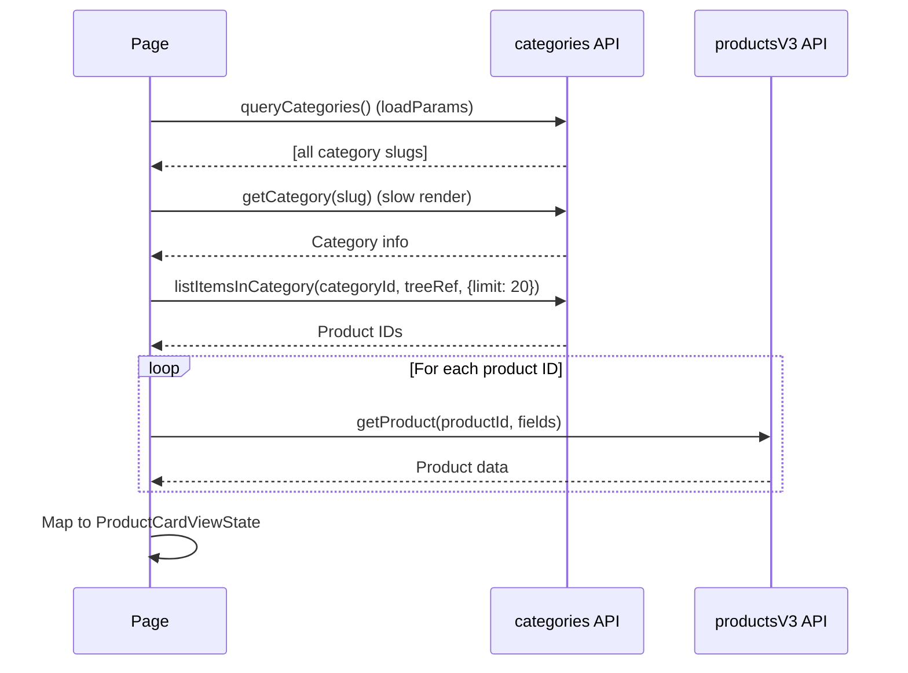

# Design Log 03: Category Pages

## Background

The Wix Stores integration needs category pages that display products organized by collection/category. Each category should have its own URL (e.g., `/categories/[slug]`) and load products using slow rendering for optimal performance.

The Wix Catalog V3 API provides:
- **Query Categories** - List categories with filtering
- **List Items In Category** - Get product IDs in a category
- **Get Product** - Fetch individual product details

Reference: https://dev.wix.com/docs/api-reference/business-solutions/stores/catalog-v3/categories

## Problem

1. **Missing component**: No `categoryPage` component exported from wix-stores
2. **Existing contract**: `category-page.jay-contract` exists but the component (`category-page.ts.back`) is outdated
3. **API mapping**: Need to map Wix Categories API (V3) to the contract structure
4. **Async products**: Products should load via slow rendering with `async: true` on the products tag
5. **URL routing**: Need `loadParams` to generate URLs for each category

## Questions and Answers

**Q1: Should we use the existing `category-page.jay-contract` or modify it?**
A: Use and update it. The existing contract is comprehensive but needs minor adjustments for async products.

**Q2: How should products be loaded - via `listItemsInCategory` or `queryProducts` with category filter?**
A: Use `listItemsInCategory` API as it provides proper arrangement and is category-specific. Then fetch full product details.

**Q3: Should pagination be server-side or client-side?**
A: Server-side pagination in slow/fast render. Client triggers page changes which reload via interactive phase.

**Q4: Should we support subcategories/nested categories?**
A: Yes, via breadcrumbs. The category tree structure from Wix supports parent-child relationships.

**Q5: How to handle sorting and filtering?**
A: Sort via `sortBy` dropdown triggers re-fetch. Filters (price, stock) applied client-side to loaded products initially, with option for server-side filtering later.

## Proposed Design

### 1. Category Page URL Structure

```
/categories/[slug]       → Category page with product grid
/categories/[slug]?page=2&sort=priceAsc  → With pagination/sorting
```

### 2. Wix API Flow



### 3. Component Structure

```typescript
// category-page.ts

interface CategoryPageParams extends UrlParams {
  slug: string;
}

interface CategorySlowCarryForward {
  categoryId: string;
  categorySlug: string;
  parentCategories: Array<{id: string, name: string, slug: string}>;
}

interface CategoryFastCarryForward {
  categoryId: string;
  totalProducts: number;
  pageSize: number;
}

// loadParams - Generate URLs for all categories
async function* loadCategoryParams(
  [wixStores]: [WixStoresService]
): AsyncIterable<CategoryPageParams[]> {
  const { items } = await wixStores.categories.queryCategories({
    treeReference: { appNamespace: "@wix/stores" }
  }).find();
  
  yield items
    .filter(cat => cat.visible !== false)
    .map(cat => ({ slug: cat.slug }));
}

// slowlyRender - Load category metadata + products
async function renderSlowlyChanging(
  props: PageProps & CategoryPageParams,
  wixStores: WixStoresService
) {
  // 1. Find category by slug
  const { items } = await wixStores.categories.queryCategories({
    treeReference: { appNamespace: "@wix/stores" }
  }).eq('slug', props.slug).find();
  
  if (!items?.length) return notFound();
  const category = items[0];
  
  // 2. Load products in category
  const productsResponse = await wixStores.categories.listItemsInCategory(
    category._id,
    { appNamespace: "@wix/stores" },
    { useCategoryArrangement: true, cursorPaging: { limit: 20 } }
  );
  
  // 3. Fetch full product details
  const productCards = await Promise.all(
    productsResponse.items.map(async (item) => {
      const { product } = await wixStores.products.getProduct(
        item.itemId, 
        { fields: ['CURRENCY', 'VARIANT_OPTION_CHOICE_NAMES'] }
      );
      return mapProductToCard(product, '/products');
    })
  );
  
  // 4. Build breadcrumbs from parent chain
  const breadcrumbs = await buildBreadcrumbs(category, wixStores);
  
  return RenderPipeline.ok({
    _id: category._id,
    name: category.name,
    description: category.description || '',
    slug: category.slug,
    visible: category.visible !== false,
    numberOfProducts: productsResponse.metadata?.totalCount || productCards.length,
    media: mapCategoryMedia(category),
    breadcrumbs,
    products: productCards,
  }).toPhaseOutput(viewState => ({
    viewState,
    carryForward: {
      categoryId: category._id,
      categorySlug: category.slug,
      parentCategories: breadcrumbs.map(b => ({
        id: b.categoryId, name: b.categoryName, slug: b.categorySlug
      }))
    }
  }));
}
```

### 4. Contract Updates

The existing `category-page.jay-contract` is mostly correct. Minor updates:

```yaml
# Ensure products link to product-card contract
- tag: products
  type: sub-contract
  repeated: true
  trackBy: _id
  description: Products in this category
  link: ./product-card
```

Remove `async: true` from products since we're loading them synchronously in slow render (they're part of the slow viewstate, not a separate async load).

### 5. Interactive Phase

```typescript
function CategoryPageInteractive(
  props: Props<PageProps & CategoryPageParams>,
  refs: CategoryPageRefs,
  viewStateSignals: Signals<CategoryPageFastViewState>,
  fastCarryForward: CategoryFastCarryForward,
  storesContext: WixStoresContext
) {
  const {
    pagination: [pagination, setPagination],
    sortBy: [sortBy, setSortBy],
    filters: [filters, setFilters],
    isLoading: [isLoading, setIsLoading],
    products: [products, setProducts],
  } = viewStateSignals;

  // Sort change triggers reload
  refs.sortBy.sortDropdown.oninput(async ({ event }) => {
    const value = (event.target as HTMLSelectElement).value;
    setSortBy({ currentSort: value });
    await reloadProducts();
  });

  // Pagination
  refs.pagination.nextButton.onclick(async () => {
    const current = pagination().currentPage;
    setPagination(patch(pagination(), [
      { op: REPLACE, path: ['currentPage'], value: current + 1 }
    ]));
    await reloadProducts();
  });

  // Add to cart on product cards
  refs.products.addToCartButton.onclick(async ({ coordinate }) => {
    const [productId] = coordinate;
    await storesContext.addToCart(productId, 1);
  });
  
  return {
    render: () => ({
      isLoading: isLoading(),
      products: products(),
      pagination: pagination(),
      sortBy: sortBy(),
      filters: filters(),
      hasProducts: products().length > 0
    })
  };
}
```

### 6. Example HTML Template

```html
<html>
<head>
  <script type="application/jay-headless"
    plugin="@jay-framework/wix-stores"
    contract="category-page"
    key="categoryPage"
  ></script>
</head>
<body>
  <div class="category-page">
    <!-- Breadcrumbs -->
    <nav class="breadcrumbs">
      <a href="/categories">All Categories</a>
      <span forEach="categoryPage.breadcrumbs" trackBy="categoryId">
        <span class="separator">/</span>
        <a href="/categories/{categorySlug}" ref="categoryPage.breadcrumbs.categoryLink">
          {categoryName}
        </a>
      </span>
    </nav>

    <!-- Category Header -->
    <header class="category-header">
      <h1>{categoryPage.name}</h1>
      <p if="categoryPage.description">{categoryPage.description}</p>
      <span class="product-count">{categoryPage.numberOfProducts} products</span>
    </header>

    <!-- Toolbar -->
    <div class="category-toolbar">
      <select ref="categoryPage.sortBy.sortDropdown">
        <option value="newest">Newest</option>
        <option value="priceAsc">Price: Low to High</option>
        <option value="priceDesc">Price: High to Low</option>
        <option value="nameAsc">Name: A-Z</option>
      </select>
    </div>

    <!-- Loading State -->
    <div class="loading-overlay" if="categoryPage.isLoading">
      Loading...
    </div>

    <!-- Empty State -->
    <div class="empty-state" if="!categoryPage.hasProducts">
      No products in this category.
    </div>

    <!-- Product Grid -->
    <div class="product-grid" if="categoryPage.hasProducts">
      <article class="product-card" 
        forEach="categoryPage.products" 
        trackBy="_id">
        <a href="{productUrl}" class="product-card-image">
          
        </a>
        <div class="product-card-content">
          <h3>{name}</h3>
          <span class="price">{actualPriceRange.minValue.formattedAmount}</span>
          <button ref="categoryPage.products.addToCartButton"
            if="quickAddType == SIMPLE">
            Add to Cart
          </button>
        </div>
      </article>
    </div>

    <!-- Pagination -->
    <nav class="pagination" if="categoryPage.pagination.totalPages > 1">
      <button ref="categoryPage.pagination.prevButton"
        disabled="{categoryPage.pagination.currentPage <= 1}">
        Previous
      </button>
      <span>{categoryPage.pagination.currentPage} / {categoryPage.pagination.totalPages}</span>
      <button ref="categoryPage.pagination.nextButton"
        disabled="{categoryPage.pagination.currentPage >= categoryPage.pagination.totalPages}">
        Next
      </button>
    </nav>
  </div>
</body>
</html>
```

## Implementation Plan

### Phase 1: Contract Updates
1. Review and update `category-page.jay-contract` (remove async from products)
2. Ensure proper `link: ./product-card` on products tag
3. Regenerate contract types

### Phase 2: Component Implementation
1. Implement `category-page.ts` component:
   - `loadCategoryParams` - yield category slugs
   - `renderSlowlyChanging` - load category + products
   - `renderFastChanging` - pagination metadata
   - `CategoryPageInteractive` - sort/filter/pagination handlers
2. Export from `index.ts`

### Phase 3: API Integration
1. Use `categories.queryCategories()` for category lookup
2. Use `categories.listItemsInCategory()` for product IDs
3. Use `products.getProduct()` for full product data
4. Map products with existing `mapProductToCard()`

### Phase 4: Example Implementation
1. Create `/categories/[slug]/page.jay-html` in example project
2. Add category listing page at `/categories/page.jay-html`
3. Add styles to `store-theme.css`

## Trade-offs

| Decision | Pros | Cons |
|----------|------|------|
| Sync products in slow render | Simple, SSG-friendly | Slower initial build for large categories |
| listItemsInCategory API | Respects category arrangement | Extra API call vs queryProducts filter |
| Server-side pagination | Fresh data per page | More API calls on page change |
| Reuse product-card contract | Consistency, DRY | Full product card data (maybe overkill) |

## Verification Criteria

1. **Category URLs**: `/categories/[slug]` resolves to correct category
2. **Product display**: Products show with correct data from category
3. **Pagination**: Page navigation loads correct products
4. **Sorting**: Sort changes reflect in product order
5. **Breadcrumbs**: Parent categories linked correctly
6. **Empty state**: Shows message when category has no products
7. **Loading state**: Shows indicator during product reload
8. **Add to cart**: Quick-add works on simple products
9. **404 handling**: Invalid category slugs return 404

---

## Implementation Results

### Files Modified

**Contract:**
- `wix/packages/wix-stores/lib/contracts/category-page.jay-contract` - Removed `async: true` from products, added `phase: fast+interactive` to products, pagination, sortBy, filters, isLoading, hasProducts
- `wix/packages/wix-stores/lib/contracts/product-search.jay-contract` - Added `categorySlug` to category filter for URL generation

**Component:**
- `wix/packages/wix-stores/lib/components/category-page.ts` - New full implementation with:
  - `loadCategoryParams` - yields all visible category slugs
  - `renderSlowlyChanging` - loads category metadata, media, breadcrumbs
  - `renderFastChanging` - loads products via listItemsInCategory + getProduct
  - `CategoryPageInteractive` - handles sort, filter, pagination, add-to-cart

**Context:**
- `wix/packages/wix-stores/lib/contexts/wix-stores-context.ts` - Added `loadCategoryProducts()` method for interactive phase reloading

**Exports:**
- `wix/packages/wix-stores/lib/index.ts` - Added export for category-page component

**Examples:**
- `wix/examples/store/src/pages/categories/[slug]/page.jay-html` - Category detail page with products grid
- `wix/examples/store/src/pages/categories/page.jay-html` - Category listing page using product-search categories

### Files Deleted
- `wix/packages/wix-stores/lib/components/category-page.ts.back` - Removed outdated backup

### Deviations from Design

1. **Products loaded in fast phase instead of slow**: Changed to `phase: fast+interactive` for products since they need client-side updates for pagination/sorting
2. **Category listing reuses product-search**: Instead of a separate category listing component, the `/categories` page reuses `product-search` which already loads categories for filtering
3. **Client-side sorting**: The `listItemsInCategory` API doesn't support server-side sorting, so sorting is done client-side in `loadCategoryProducts()`
4. **API signature fix**: `listItemsInCategory` requires `treeReference` as second argument: `listItemsInCategory(categoryId, { appNamespace: "@wix/stores" }, options)`
5. **Cursor-based pagination**: The API uses cursor paging, not offset paging. Initial implementation fetches first page only; cursor tracking for subsequent pages is a future enhancement

### Next Steps
1. Run contract type generation (`yarn build` in wix-stores package)
2. Test with real Wix Stores data
3. Add category images to listing page when available from API
