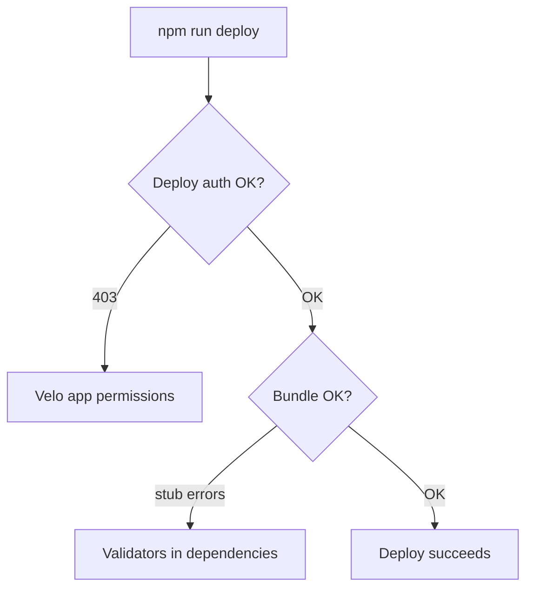

# Design Log #30 — BaaS Deploy Operations

## Status

Implemented (documented from production incident)

## Background

DL#20 defines the BaaS deployment architecture. DL#22 defines the deploy pipeline (`build:production` → `build-entry` → `upload-backend` → `deploy-baas`, now unified as `wix-deploy/deploy`).

This log captures **operational failures** discovered during the first production deploy of a Jay Stack site to Wix BaaS — Wix-specific deploy permissions and bundle composition — and how to diagnose them.

Runtime build-artifact issues (e.g. stale `page-parts.json`) are documented in the Jay framework — see Jay DL#174.

## Problem

Deploy failures fall into two independent Wix-specific layers. Fixing one does not fix the other.



## Layer 1 — Deploy permissions (403)

### Symptoms

```
[deploy] baas | Creating deployment...
Error: 403 Forbidden
Permission 'VELO.APP_PROJECT_READ' denied for app with id '<appId>'
```

Deploy fails before upload completes. `npx @wix/cli login` succeeds; site co-owner access is not enough.

### Root cause

Wix Velo (Backend as a Service) permissions apply to the **headless application** (`appId` in `wix.config.json`), not just the logged-in user. The deploy CLI deploys as that application. Both the user and the application must have the permission.

### Required permissions

| Permission                   | Purpose                                     |
| ---------------------------- | ------------------------------------------- |
| `VELO.APP_PROJECT_READ`      | Read app project metadata before deployment |
| `VELO.APP_DEPLOYMENT_CREATE` | Create and release deployments              |

### Fix

1. Open the permissions dashboard for your headless application (`appId` from `wix.config.json`):

   `https://manage.wix.com/apps/<appId>/dev-center-permissions`

   Replace `<appId>` with the value from `wix.config.json`.

2. Add both permissions above
3. In your terminal, refresh the Wix CLI OAuth session (run these commands in order):

   ```bash
   npx @wix/cli logout
   npx @wix/cli login
   ```

4. `npm run deploy`

### Verification

```bash
npx @wix/cli whoami          # confirms logged-in account
npm run deploy               # should pass "Creating deployment..."
```

### Notes

- Dashboard may show "unreleased changes" for CLI-created apps — releases happen from the local deploy command, not the dashboard Release button
- API key in `config/.wix.yaml` is for **runtime** Wix SDK access (data, stores, etc.) — separate from deploy OAuth

## Layer 2 — Bundle composition (build-time validators)

### Symptoms

- Deploy succeeds but every page returns 500
- Log mentions stub failures: `walkElements`, `resolveBinding`, `parseTemplateParts`
- `entry.mjs` is unexpectedly large

### Root cause

Build-time-only packages listed in `dependencies` (not `devDependencies`) are discovered as plugins and bundled into `entry.mjs`. Their compiler APIs are stubbed in the BaaS bundle — calling them at runtime throws.

Common offenders:

| Package                         | Role                      |
| ------------------------------- | ------------------------- |
| `@jay-framework/wix-media`      | jay-html media validation |
| `@jay-framework/seo-validator`  | SEO validation            |
| `@jay-framework/a11y-validator` | Accessibility validation  |

### Fix

Move validators to `devDependencies`:

```json
{
  "dependencies": {
    "@jay-framework/wix-server-client": "^0.22.2",
    "@jay-framework/wix-data": "^0.22.2"
  },
  "devDependencies": {
    "@jay-framework/wix-media": "^0.22.2",
    "@jay-framework/seo-validator": "^0.22.2",
    "@jay-framework/a11y-validator": "^0.22.2"
  }
}
```

`wix-deploy/build-entry` also excludes these plugins by default (`DEFAULT_EXCLUDE_PLUGINS`). Keeping them out of `dependencies` is the project-level guard.

### Verification

```bash
npm run build:production
jay-stack-cli run wix-deploy/build-entry
# entry.mjs should not import validator packages
npm run deploy
```

## Credential model (quick reference)

| File               | Used for                       | Key fields                     |
| ------------------ | ------------------------------ | ------------------------------ |
| `wix.config.json`  | Deploy target (BaaS + CDN)     | `appId`, `siteId`              |
| `config/.wix.yaml` | Runtime Wix SDK (build + BaaS) | `apiKey`, `clientId`, `siteId` |

Headless setups may use different sites for deploy vs data/API access. Simple setups use one site for both.

## Deploy checklist

```bash
# 1. Permissions configured in Dev Center (one-time)
# 2. Credentials
jay-stack-cli setup
npx @wix/cli login

# 3. Build
npm run build:production

# 4. Bundle + deploy
npm run deploy

# 5. Smoke test
curl -s -o /dev/null -w "%{http_code}" https://<release-url>/
```

## Local testing before deploy

```bash
node serve.mjs
# http://localhost:4000
```

`serve.mjs` is generated by `wix-deploy/build-entry`. It uses `WixDataArtifactStore` by default (fetches lazy artifacts from the data collection for the deployed version). For fully offline local testing of a fresh build, set `JAY_BACKEND_DIR` to the local backend directory — see agent-kit `wix-baas-deployment.md`.

## Trade-offs

| Decision                                                  | Rationale                                                                                                         |
| --------------------------------------------------------- | ----------------------------------------------------------------------------------------------------------------- |
| Document Wix ops in wix repo, build artifacts in jay repo | Permissions and bundle composition are Wix deploy concerns; `page-parts.json` staleness is framework (Jay DL#174) |
| Agent-kit troubleshooting over design log for agents      | Agents need symptom → fix tables; design log captures why                                                         |
| Unified `deploy` command                                  | Reduces manual steps (DL#22)                                                                                      |

## Verification Criteria

- [ ] New project deploy guide includes permissions table
- [ ] 403 during deploy → actionable error message (future: improve wix-deploy CLI output)
- [ ] Validator packages documented as devDependencies only

## Related

- DL#20 — BaaS deployment architecture
- DL#21 — BaaS entry framework requirements
- DL#22 — Deploy pipeline
- Jay DL#174 — page-parts staleness (framework; not Wix-specific)
